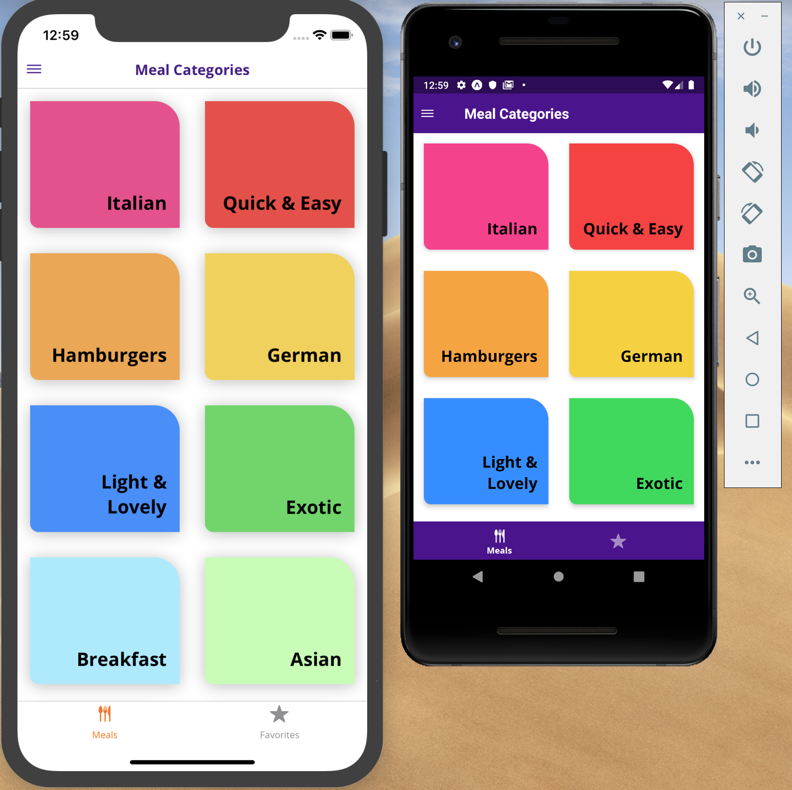
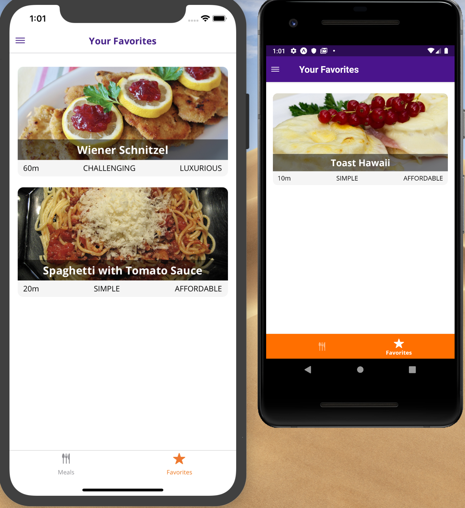
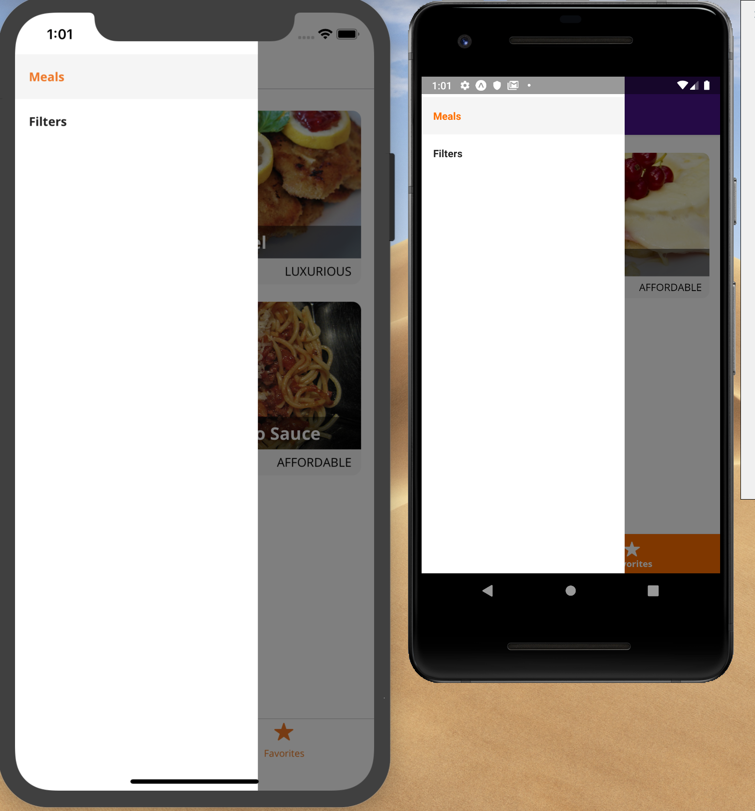
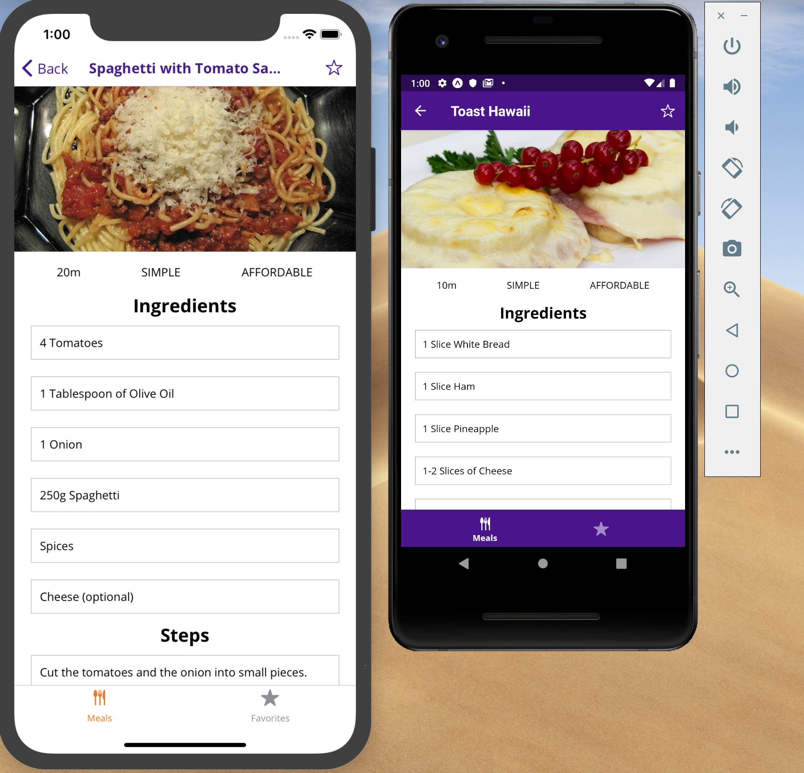
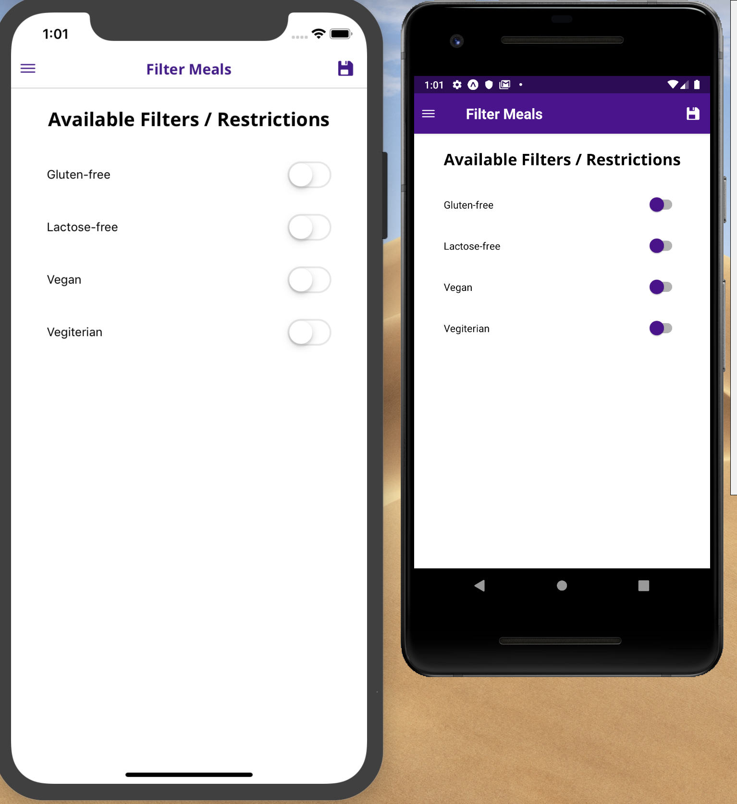

# MealsToDay

MealsToDay is a mobile application built with React-native to help users keep track of there favourite meals, ingredients used in making these meals and also for some a way of how to make these meals them selves.

## Getting Started

These instructions will get you a copy of the project up and running on your local machine for development and testing purposes.

### Prerequisites

```
- Android Emulator
- JDK
- IOS Emulator
- Xcode 10+
```

### Installing

```
- Clone the repo into your local env using terminal
- install dependencies/packages by running yarn or npm install
```

## Built With

- Expo

```
Technologies
- React-native
- React
- Redux
- React-navigation
- React Hooks
```

## Images

#### Welcome Screen


#### Favourite Screen

#### Navigation Drawer

#### Meal Detail Screen

#### filter Screen


## Authors

- **Mugisha Joshua**
